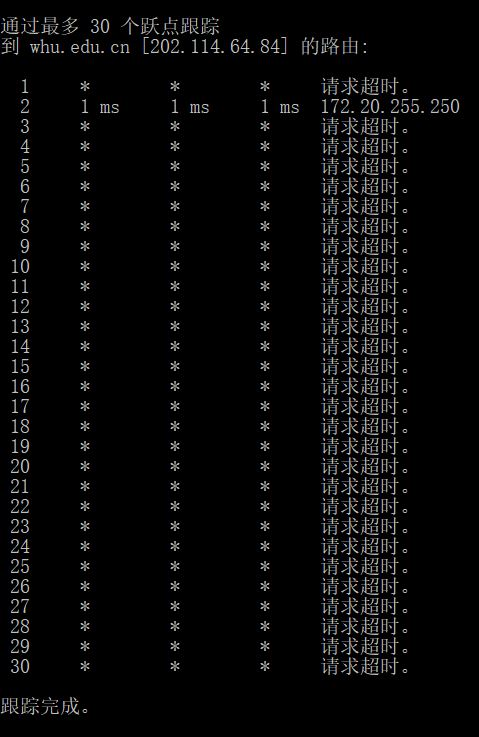
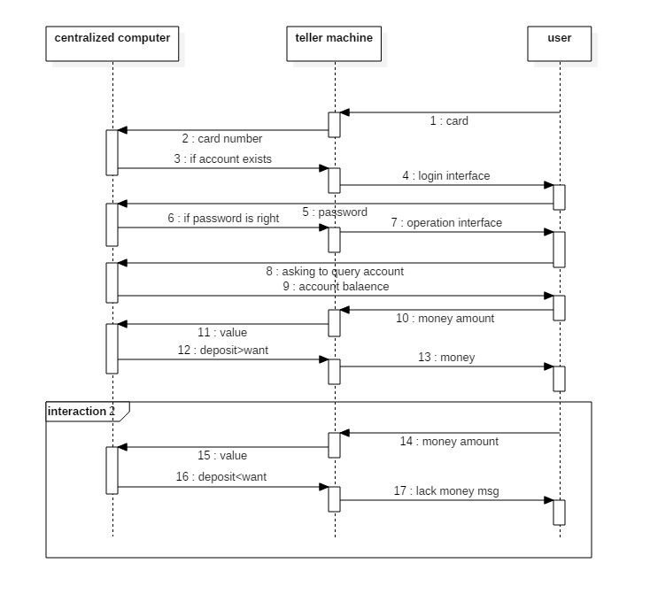

stu id: 2016302580318 杜致

- 

- 

- p1

- p2

  when the last packet goes: (P-1)*(L/R)

  delay= (P-1+N)*(L/R)

- p19

  a) 

  f to u: 4 same routes(img 4/6) 

  France to Canada: no same route with America's(6/7)

  b)

  g to u: 9 same routes with f(6/8)

  c)

  f to c(beijing/shanghai): 4 same routes sending from France and then diverge before reaching(9/10)
